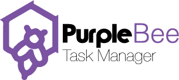

<p align="center">
  
</p>

# PurpleBee - AI-Powered Productivity Dashboard · v1.11.0

A modern, enterprise-grade productivity management platform with advanced task management, project tracking, team chat, AI insights, and multi-channel notifications.

**Live staging:** https://purplebee-staging.onrender.com
**Repo:** https://github.com/SaphoM/PurpleBee

## Features

### Task Management
- Multi-level priorities (Low, Medium, High, Urgent)
- Status tracking (To Do, In Progress, Review, Completed)
- **Due date is required on task creation** — the Create Task modal pairs a native date picker with a time picker (defaults to 17:00) for fast entry; the date field defaults to today and has a `min` constraint set to today so past dates are not selectable and cannot be submitted; submitting with a missing or past date shows inline validation ("Due date is required" / "Due date cannot be in the past"); date + time combine into a single `dueDate` timestamp on the task; `createdAt` is always stamped to `new Date()` at submit time
- Progress visualization (0–100%) — auto-updates when a task is dragged between Kanban columns: `completed → 100%`, `review → 75%`, `in-progress → 10%`, `todo → 0%`
- Drag-and-drop Kanban — column changes persist to Supabase immediately in live mode; mock mode updates Zustand in-memory state
- **Completion approval gate** — regular members (`role: 'user'`) cannot mark a task as completed through any path. Every entry point is blocked:

  | Path | Enforcement |
  |---|---|
  | Drag card to Completed column | `handleDragEnd` returns early; `isDropDisabled` on the Droppable |
  | Inline status dropdown on task card | Completed option is `disabled` with a "manager only" label |
  | Status picker in task detail modal | Completed option disabled with explanation text |
  | Progress slider / subtask completion | `getStatusFromProgress` caps at Review even at 100% |

  The Completed column header shows a lock badge ("Manager approval required") for restricted users. Only Admin and Manager roles can mark tasks as completed. Applies in both mock/sample data mode and live Supabase mode.

- Recurring tasks with customizable patterns
- Subtasks (Mini Tasks) with inline add — the add form shows a **Title** field (required) and a **Description** field (optional, "Brief explanation"); both in the task detail modal (Mini Tasks section) and the Create Task modal (Subtasks section); pressing Enter on the title field also submits; added subtasks show their title and description in the list; the `+` / "Add subtask" button activates once a title is entered
- **Completed subtask reveal** — completed subtasks show with a strikethrough in a green container row; hovering (or touch-holding on mobile) the entire green row temporarily reveals the unstruckthrough text so it can be read; the hover area covers the full container, not just the text
- Mini tasks persist to Supabase `subtasks` table in live mode; loaded alongside parent tasks on hydration; completion ratio drives the task progress bar (completed ÷ total × 100); subtasks added via the Create Task modal are assigned proper UUIDs so Postgres accepts the insert — previously they used `sub-0`, `sub-1` placeholder IDs which Postgres rejected, causing subtasks to disappear after save
- **File attachments, images/screenshots, and links** — the same Attachments & Links UI (Upload button, Add Link form, image thumbnail grid, file list with size/download) is available both in the **Create Task** modal (attaching before the task exists — files are held in local state and submitted with the task) and in the **Task Detail** modal for existing tasks; link type is auto-detected (Figma, GitHub, Notion, Google Docs, or generic) and image attachments render as thumbnails while other files show a name/size row with download; persists to Supabase `tasks.attachments` / `tasks.links` (JSONB) in live mode — `taskDb.insert` was previously missing these columns even though `taskDb.update` had them, so attachments added at creation time would silently vanish in live mode; both paths now persist correctly
- **Project References** — the Add Link form in the Task Detail modal now supports 15+ categorized reference types alongside the original ones (Discovery Meeting, Wireframe, Requirements, Scope Doc, Google Drive, SharePoint, OneDrive, Loom, YouTube, Vimeo, plus the existing Figma/GitHub/Notion/Google Doc/generic Link), each with its own icon; a category still auto-detects from the URL by default, or can be set manually via a "Category" dropdown when the URL is ambiguous
- **Drag-and-drop & clipboard paste for attachments** — the Attachments & Links drop zone in the Task Detail modal now also accepts files dragged in from the desktop and images pasted directly from the clipboard (in addition to the existing Upload button), all going through the same upload path so behavior is identical regardless of how the file arrives
- **Attachment image lightbox** — clicking an image thumbnail in the Task Detail modal now opens it in a full-screen preview overlay instead of a new browser tab
- **Task Activity Timeline** — every task now keeps a permanent, append-only history of who changed what and when: creation, field edits (status, priority, title, description, assignee, due date — old and new value both recorded), attachments/links added or removed, subtask changes, and deletion. A collapsible "Activity" section in the Task Detail modal (below Attachments & Links) lists each event with the actor's avatar/name, a relative timestamp, and a plain-language description, lazily loaded on expand with "Load more" pagination; stored in a new `task_activity` table that denormalizes the task title and team so the record survives even if the task itself is later deleted; global search (top bar) now also matches attachment file names and link titles
- Time estimation and tracking
- Task assignment to team members — Assigned To card in the task detail modal resolves the UUID to the member's name and avatar from `assignableMembers`
- **Assigned-to-me YOU badge** — in the Create New Task title dropdown, tasks assigned to the logged-in user show a solid green "YOU" pill badge and float to the top of their project group; the project colour indicator is a thin vertical bar so it cannot be confused with the badge
- **Scheduled / to-schedule counter** — the dropdown header shows "X scheduled · Y to schedule" counts at a glance; tasks already on the board show a grey ✓ Scheduled pill and dimmed text; remaining tasks show in full colour
- `createdBy` stamped on every new task; hydrated from `created_by` DB column on load
- **General task notes** — each task has a dedicated "Notes" section in the detail modal (sticky-note icon); click "+ Add note" to open an inline textarea; Save persists via `updateTask({ notes })`; Cancel reverts; displayed text supports clickable URLs; syncs when switching between tasks
- **Clickable URLs everywhere** — any `http(s)://` URL in a chat message, docked mini-chat message, task description, or task progress note is automatically rendered as a clickable `<a target="_blank">` link via a shared `linkifyText()` utility (`src/utils/linkify.tsx`); no `dangerouslySetInnerHTML` — URL segments are split and wrapped safely

### Multiple View Modes
- **Kanban Board** — Drag-and-drop task management; toggle via the view switcher on the Tasks page
- **List View** — Traditional task list with filtering; toggle via the same view switcher
- **Calendar View** — Deadline visualization; its own page (month grid, agenda list, and upcoming-tasks grouping) accessed from the sidebar

### Project Management
- Project templates (Web App, Mobile, Marketing, Product Sales, API, Design System, Training, Services, Cybersecurity, Cloud Computing, Support, Custom)
- Project task breakdown with suggested tasks per template
- **Company logo upload** — available both when creating a project (step 1 of the wizard) and when editing an existing one (Edit Project modal); optional image (PNG/JPG, up to 1MB, validated client-side) stored as a data URL in `project.icon`; when present it renders as a small circular badge alongside (not instead of) the template's outline icon — top-right on grid cards next to the edit/delete/chevron controls, and next to the status pill in the detail header; removing the logo in the Edit modal reverts `icon` to the project's template default emoji rather than leaving it blank; persists to Supabase `projects.icon` (`text`, no length cap)
- **Product Name field** — shown in the wizard only when the Product Sales template is selected; optional, persists to `projects.product_name` and displays as a small subtitle under the project name in the detail header
- **Bulk-assign on project creation** — step 3 of the Create Project modal has an "Assign all to" dropdown that fills every task's individual assignment select with one click; individual dropdowns remain editable afterwards for overrides
- Team member assignment per project task — triggers instant `task-assigned` notification to the assignee (live mode)
- Project status tracking (Planning, Active, On Hold, Completed)
- **Edit projects** — Admin/Manager can update name, description, and status inline via edit modal
- Delete projects with confirmation modal
- **Universal delete confirmation** — every destructive delete action across the app (tasks, projects, project tasks, chat messages in both the main Chat page and docked mini-chats) shows a consistent confirmation modal: full-screen `bg-black/50 backdrop-blur-sm` overlay, `max-w-md` centred card, `w-16 h-16` red icon circle, `text-xl` bold title, outlined Cancel + solid-red Delete button; a success toast fires after every confirmed delete
- **Project task description** — when adding a custom task on the project detail page, a description textarea appears below the title input once the user starts typing; description is saved with the task and cleared on Cancel/Escape. The same optional description field is available in the **Create Project wizard**'s step-2 "Add Custom Tasks" input — for both template-based and pure Custom (no-template) projects — and persists to Supabase's `project_tasks.description` column alongside title, priority, and estimated hours
- **Auto-update project status** — the project detail view watches linked board task statuses via a `useEffect` and derives the project status automatically: all linked tasks completed → `completed`; any task in-progress or review → `active`; manual `on-hold` is preserved unless all tasks complete
- **Projects sidebar always returns to list** — clicking the Projects nav item always resets to the project grid, even when a project detail is open, via `setActiveProjectId(null)` in `uiStore`
- Projects persist to Supabase for real users
- **Drag-to-reorder project grid** — hover any project card to reveal the grip handle (⠿) on the left edge as a visual affordance; drag from anywhere on the card to reorder
- **Sort projects** — a custom "Sort by" dropdown next to the search bar (checkmark + purple highlight on the active option, matching the app's design system rather than the native OS select) offers Custom Order (the drag order above, default), Highlighted First (pins long-press-highlighted projects to the top; tie-breaks by custom order within each group), Date Created, Date Updated, or Name; the last three have an ascending/descending toggle button (Custom Order and Highlighted First don't — prioritization is inherently one-directional). Drag-to-reorder is only active while Custom Order is selected (dragging under any other sort is disabled — it would silently reorder a hidden list without any visible effect). The choice persists to `localStorage` keyed by user ID
- **Long-press to highlight project cards** — hold a project card for 500 ms to toggle an amber highlight on it; long-press again to deselect; highlighted state persists to `localStorage` keyed by user ID so it survives page refresh; the click-to-open action is suppressed when a long press fires so there is no accidental navigation (the outer card `div` is the drag source — browser drag events do not fire reliably from inside `<button>` elements, so `draggable` is on the card rather than the grip); a `didDragRef` flag prevents the card's click handler from opening the project detail after a drag ends; the dragged card dims and shrinks, the drop target highlights with a purple ring and lifts slightly; order is persisted to `localStorage` keyed by user ID and survives page refresh; new projects append to the end; deleted projects are pruned automatically

### Team Collaboration
- Team invite system (magic link email + shareable URL) — when inviting a member, the Admin selects one or more departments via pill toggles (General, Engineering, Design, Product, QA, DevOps, Marketing, Operations); selected pills show a ✓ and an × to deselect; a **⊕** pill at the end opens an inline input to add any custom department not in the list; multiple selections stored as a comma-separated string (e.g. `"General, DevOps"`) in the `invites.department` column; on invite acceptance (`inviteDb.accept`) the department is written to the new member's `profiles.department`; the invite accept page shows the assigned department to the invitee before they join
- Role-based access control (Admin, Manager, User)
- **Edit team members** — Admin/Manager can update name, job title, department, and role; persists to `profiles` + `team_members` in live mode; UI updates immediately in both demo mode (overlays `assignableMembers` onto the card) and live mode (always uses the updated `assignableMembers` entry rather than the stale `chatStore` copy)
- **Task project label in member detail** — each task listed in the member detail modal shows the project it belongs to (icon + name) in small type below the task title
- In-app team chat with docked chat windows
- **Mobile wallet view for multiple docked chats** — on responsive/mobile layouts, docking a single conversation opens it directly in the bottom sheet as before; docking a second (or more) switches the default view to a stacked "wallet" overview (cards fanned like boarding passes), each showing the conversation's avatar, name, and unread count, with the frontmost card also showing a last-message preview; tapping a card **behind** the front one switches in one tap — the tapped card shuffles to the front (both cards flick 40 px left then settle, 150 ms) and the conversation opens immediately in the bottom sheet; tapping the **front** card opens it directly; the wallet strip remains visible below the open bottom sheet at all times (backdrop clips at the wallet's top edge, sheet lifts by the wallet's height so nothing is obscured); swiping the sheet down returns to the wallet stack rather than undocking — only the header's × button actually undocks a conversation; on the **mobile Chat page**, tapping any conversation row routes through the wallet system (calls `dockChat`) rather than the old in-page full-screen overlay, so the wallet/bottom sheet experience is consistent across the whole app
- Admin "View As" to preview other members' dashboards
- Smart notifications (assignments, due dates, mentions, AI insights)
- Chat messages trigger `mention` notifications to **all other conversation participants only** — never the sender. A user never receives an unread notification for a message they themselves sent (enterprise rule; matches Teams/Slack/Linear). Each recipient's notification row is inserted with `conversation_id` set, so clicking the bell alert deep-links straight to that conversation; delivery is unconditional at write time and the recipient's own `mentions` preference is applied at display time
- On send, the sender's bell is untouched; each recipient's `conversation_participants.unread_count` is incremented and a `mention` notification row is written for them. Their bell updates live via the `notifications` Realtime subscription (filtered by `user_id`) and their conversation unread badge via the `messages` Realtime subscription — no refresh required
- **Unread counts persist across sessions** — `conversation_participants.unread_count` is written on every incoming message and reset to 0 when a conversation is opened; badge counts are correct on login without needing a Realtime event to fire first
- Task completion triggers `task-completed` notification to the task creator (live mode)
- **Bell icon always functional** — the notification bell is always clickable and always shows the Bell icon regardless of in-app preference setting; the `inApp` preference controls notification delivery, not bell visibility
- **Announcement & team channels visible to all team members** — new members are auto-joined to all `announcement` and `team` type channels on login, so they immediately see all historical messages regardless of when the channel was created
- **DM creation for non-admin users** — regular users (role: 'user') can now create DMs with any team member; previously the `conversation_participants` INSERT RLS policy only allowed `user_id = auth.uid() OR is_admin_or_manager()`, which caused the batch insert to fail when kamo added nhlakanipho (user_id != auth.uid() and not admin); fixed by updating the policy WITH CHECK to also allow `is_conversation_participant(conversation_id)` — so inserting the current user's row first unlocks adding the peer — and updating `createConversation` in `dataService.ts` to always insert the current user's participant row first
- **Drag task to chat** — drag any task card from the Kanban board onto a docked chat window or bubble to attach it; a rich task card preview (title, status, priority, progress bar, subtask count, project name) appears in the input area; type an optional comment anchored to the card and send — the task card renders inline at the top of the message bubble with the comment below it
- **Task card visual styling in chat** — received task card bubbles use a light fresh green gradient (`from-emerald-50 to-white`); sent (isMe) task cards use a solid emerald-700 green covering the left 55% fading to transparent so the card reads as green against the purple bubble with legible white text
- Task card attachments persist to Supabase via `task_ref JSONB` column on the `messages` table; hydrated on load so the card renders correctly after a page refresh — both in docked chat windows and in the full Chat page conversation view
- **Message actions (long-press or right-click)** — hold any message bubble to reveal the context menu: **Reply** (quoted reply banner above input; sent bubble shows original sender + preview with purple left-border), **Forward** (conversation picker), **Copy** (clipboard), **Edit** (inline text input, persisted to DB; "edited" label shown), **Info** (timestamp tooltip), **Star** (amber ★ marker), **Delete** (soft-delete — bubble shows "Message deleted"; `is_deleted` persisted to DB), **More…** (extensible)
- **Chat auto-select** — after `hydrateFromDb` loads conversations in live mode, the first conversation in the list is automatically selected so the Chat page is never blank on initial load
- **Sender is never self-notified** — sending a message does not create a notification for the sender in any mode. Only other participants are alerted (see the notification rules above). Forwarded messages sent to a background conversation still increment that conversation's unread-count badge in the sidebar for the current user, which is a conversation badge, not a bell notification
- **Read receipts** — sent messages (isMe) show double-tick indicators below the bubble: grey double-ticks when the message is unread by others, blue double-ticks once at least one other participant has read it; reader avatars appear as a tight stack of tiny circles (max 3 shown, +N overflow) with tooltip names, visible in both the main Chat page and docked mini-chat windows; applies to all conversation types (DM, team, task, announcement)
- **Inline quick-edit for project tasks** — a pencil button (managers/admins only) on each project task row opens an in-place edit form with fields for title, description, priority, estimated hours, and tags; the row highlights with a purple border while editing; Save calls `updateProjectTask`, Cancel discards; no changes to templates
- **Editable chat messages (15-minute window)** — users can edit their own messages within 15 minutes of sending via the context menu Edit option; admins can always edit regardless of age; after 15 minutes the Edit item remains visible but is greyed out (opacity-35, cursor-not-allowed) with a "15 min limit" badge and tooltip; the existing "edited" label on the bubble is unchanged (audit log preserved)
- **Full-message edit textarea** — the edit input is a `<textarea>` that auto-sizes on open to show the entire message and grows as you type; Enter saves, Shift+Enter inserts a newline, Escape cancels; Cancel/Save buttons shown below; applied to both main Chat and docked windows
- **Real-time message delivery** — inbound messages appear instantly without a page refresh; `chatStore` subscribes to a `postgres_changes` INSERT event on the `messages` table via Supabase Realtime; each new row is fetched with full sender profile, reactions, and attachments via `chatDb.fetchMessageById`, de-duplicated against existing optimistic inserts, and merged into the store — unread count increments for background conversations and auto-clears for the active one; the subscription is started after `hydrateFromDb` and torn down on logout
- **Typing indicator** — "[Name] is typing…" with an animated three-dot bounce appears above the input in both the docked chat window and the full Chat page when the other participant is composing a message; powered by Supabase Realtime **Broadcast** (`typing:{conversationId}` channel) — ephemeral, never written to a DB table; the indicator clears as soon as the other side sends or pauses typing for 2s, with a 4s auto-expiry safety net in case the "stopped typing" signal is missed (e.g. their tab closes mid-keystroke); only active when Supabase is connected — no-op in offline demo mode since there's no second participant to broadcast to; the channel is reference-counted in `chatStore`, so opening the same conversation in both the docked window and the full Chat page (or any other overlap) shares one connection instead of one view's unmount tearing down the channel out from under the other
- **Typing status in the conversation list** — the Chat page sidebar subscribes to typing presence for every visible conversation (not just the one currently open), so a row's last-message preview is replaced with "[Name] is typing…" the moment they start composing, reverting to the normal preview when they stop or send; the list's subscribe key is sorted so a conversation jumping to the top from new activity doesn't spuriously tear down and rejoin every channel; joins are staggered (~120ms apart) rather than fired in one burst, and a join that comes back as `TIMED_OUT`/`CHANNEL_ERROR`/`CLOSED` is automatically torn down and retried up to 3 times
- **Online presence indicator** — powered by Supabase Realtime **Presence** on a team-scoped channel (`presence:team-{teamId}`); each user tracks their session on subscribe so the green/grey dot next to DM avatars and in the "New Message" member list reflects live status; `join` events mark users online instantly, `leave` events mark them offline and stamp `lastSeen`; the full `sync` event rebuilds the entire online set so a page refresh or late subscribe catches up correctly; presence is started after `hydrateFromDb` and torn down on logout — previously all participants except the current user were hard-coded as offline regardless of activity

### Global Search
- TopBar search bar filters content across every page in real-time
- **Tasks page** — Kanban columns filter cards by title, description, and tags
- **Projects page** — project grid filters by name, description, status, and template type; inline page search bar is synced with the TopBar
- **Team page** — member cards filter by name, title, department, and email
- Clicking a dropdown result navigates to the matching page and pre-filters to that result
- Shared via `globalSearchQuery` in `uiStore` — single source of truth, no prop drilling

### Notifications (Live Mode)
All notifications are written directly to Supabase via `notificationDb.insert` and delivered in real-time to the recipient's bell via Supabase Realtime (`postgres_changes` on the `notifications` table filtered by `user_id`). Mock mode uses in-memory notifications only.

| Trigger | Type | Recipient |
|---|---|---|
| Project task assigned | `task-assigned` | Assignee |
| Kanban task assigned | `task-assigned` | Assignee |
| Kanban task completed | `task-completed` | Task creator |
| Chat message sent (DM or channel) | `mention` | All other participants |

### Purple Bee Bot (in-app task assistant)
- A floating **Purple Bee Bot** assistant (bottom-right) runs a guided **Create / Edit / Delete Task** flow entirely in-app — pick a project (top-3 quick-pick + "show more"), enter title/subtasks/description, and the task is created via the normal `taskStore.addTask` path.
- Bot-originated tasks (including future Telegram "database mode" tasks) are stored in a separate `public.bot_tasks` table (TEXT `user_id` matching the app's `user-1..user-5` identities, disjoint UUID id-space from `public.tasks`) and are concatenated into the store alongside team tasks on hydration (`botTaskDb.fetchAllForUser`). Project membership for the bot lives in `bot_projects` / `bot_project_members`.
- **Creator-only deletion**: a task's `createdBy` is stamped on creation; only the creator may delete it (`canDelete` in the task detail modal; `deleteTask(id, requestingUserId)` returns `false` and no-ops for non-creators). Legacy/unattributed tasks remain deletable by anyone.
- **Deferred — Telegram/WhatsApp channel server**: the frontend bot + `bot_tasks` storage are live, but the standalone Telegram bot **server** (socket.io transport, `telegram-notify` edge function, `chatbot_sessions`/`chatbot_messages` logging tables) is **not yet deployed** — it requires a bot token, webhook, and its own service before the Telegram channel is functional. The frontend socket client (`chatStore`, `botSocket`) points at `VITE_API_URL` (default `http://localhost:3000`). The `chatbot_messages` migration is intentionally left unapplied until that server lands.

### Sample Data Toggle
- **ON** — all stores use in-memory mock data; DB is never read or written
- **OFF** — all stores hydrate from Supabase on login; mock data is cleared
- Toggling OFF calls `clearMockData` + `hydrateFromDb` on all stores
- DB tables start empty for new accounts — no auto-seeding in live mode
- **Auto-live mode for real users** — `loginWithEmail` and `initSession` (page-refresh path) force `keepMockData = false` before hydration; real Supabase users are never left in mock mode regardless of what was last persisted in `localStorage`

### Dashboard & Analytics
- **Classic and Modern dashboard layouts** — both pull live data from Supabase when sample data is OFF
- Completion trend chart — last 7 days, grouped by `updatedAt` date
- Focus sessions chart — task activity grouped by hour of day
- Weekly activity bar chart — task updates grouped by day of week
- Card percentage stats (Completed %, In Progress %, To Do %) rendered correctly as `{value}%`
- Priority distribution analysis
- Focus session tracking
- AI-generated recommendations
- Team performance metrics

### AI Insights
- Dedicated page (sidebar → AI Insights) that derives insights directly from the current user's real task data — no external AI API call
- Categorized tabs: **All**, **Productivity**, **Risks**, **Suggestions**, **Forecasts**
- Each insight has a severity (info / success / warning / critical), a confidence score, an impact rating, and an optional action button
- Thumbs up/down feedback and dismiss per insight (session-local, not persisted)

### Customization
- 6 accent color themes (Purple, Blue, Green, Amber, Red, Pink)
- Dark/Light mode
- Classic and Modern dashboard layouts
- Collapsible sidebar (icon-only mode) — sidebar header height matches the TopBar search container height (`h-20`) so the top strip is flush across the full layout
- Configurable tooltip system
- **Branding** — PurpleBee logo (`public/logo.png`) shown in the sidebar header and on the login page; sidebar displays the app version below the logo, read dynamically from `package.json` so it always matches the GitHub release

## Tech Stack

| Layer | Technology |
|-------|------------|
| Framework | React 18 + TypeScript 5 |
| Build | Vite 4 |
| Styling | Tailwind CSS + CSS custom properties (accent theming) |
| State | Zustand 4 (7 stores) |
| Charts | Recharts 2 |
| Icons | Lucide React |
| Auth & DB | Supabase (Auth + Postgres + RLS) |
| Realtime | Supabase Realtime (`postgres_changes` · Broadcast · Presence) |
| Hosting | Render (static site, staging branch auto-deploys) |
| Utilities | clsx, uuid, date-fns |
| Version | 1.11.0 — sidebar version badge reads from `package.json` at build time |

## Auth Architecture

Authentication is handled entirely by **supabase-js** — there is no backend Express proxy.

- `supabase.ts` creates a standard `createClient` with `persistSession: true`, `autoRefreshToken: true`, and `detectSessionInUrl: true`. No custom `global.fetch` override or manual token tracking (`_tokenRef`) — supabase-js injects the live, auto-refreshed `Authorization` header into every PostgREST/Storage/Realtime request natively.
- `userStore.initSession` waits for the `INITIAL_SESSION` GoTrue event (fires after the full startup/refresh cycle) rather than calling `auth.getSession()` directly, which avoids a race where GoTrue's async lock could wipe a freshly stored session.
- A shared `restoreUserSession()` helper is used by both login and page-refresh paths to populate the user store, resolve team membership, hydrate all stores, and apply the effective role from `team_members`.
- The app is deployed as a **static site on Render** — there is no server-side component. All auth is client-side Supabase.

> **Why this matters for JWT changes:** If you update Supabase JWT settings (expiry, signing secret, rotation), supabase-js auto-refreshes tokens transparently. Any custom fetch override that injects a manually-tracked token will go stale immediately and cause 401s on all REST queries — which is why that pattern was removed.

## Store Architecture

| Store | Responsibility |
|---|---|
| `userStore` | Auth, session, team resolution, store hydration orchestration, `updateMember` |
| `taskStore` | Kanban tasks, drag-persist via `moveTask`, notifications on assign/complete, `createdBy` stamping |
| `projectStore` | Projects + project tasks, assignment notifications |
| `chatStore` | Conversations, messages, chat message notifications |
| `notificationStore` | Notification inbox, Realtime subscription, preferences |
| `settingsStore` | App settings, sample data toggle, accent colour |
| `uiStore` | Sidebar state, dark mode, view mode, `globalSearchQuery` (cross-page search) |

### Context injection (no circular deps)
`userStore` injects `userId`/`teamId`/`userName` into `taskStore` and `projectStore` via exported setter functions (`setTaskUserContext`, `setProjectUserContext`) — avoids the `require()` pattern which is not available in Vite's ESM browser runtime.

## Role-Based Access Control

| Capability | Admin | Manager | Member |
|---|:---:|:---:|:---:|
| View all tasks | ✅ | ✅ | Own only |
| Mark task as Completed | ✅ | ✅ | ❌ |
| Invite team members | ✅ | ❌ | ❌ |
| Edit team member profiles | ✅ | ✅ | ❌ |
| Edit / delete projects | ✅ | ✅ | ❌ |
| View As another member | ✅ | ✅ | ❌ |

## Quick Start

### Prerequisites
- Node.js 18+
- npm

### Installation

```bash
# Clone the repository
git clone https://github.com/SaphoM/PurpleBee.git
cd PurpleBee

# Install dependencies
npm install

# Setup environment (optional - app runs in demo mode without Supabase)
cp .env.example .env
# Edit .env with your Supabase URL and anon key

# Start development server
npm run dev
# Opens at http://localhost:5173
```

### Demo Mode
Without Supabase credentials, the app runs fully in demo mode with mock data. Use the Quick Login screen to pick a role (Admin, Manager, Team Member) and explore all features.

### Production Build
```bash
npm run build
# Output in dist/ — deploy to any static host
```

## Project Structure

```
src/
├── components/       # Reusable UI (Sidebar, TopBar, KanbanBoard, ChatBot, etc.)
├── pages/            # Page components (Dashboard, Tasks, Projects, Chat, etc.)
├── stores/           # Zustand state management (7 stores)
├── lib/              # Supabase client (`supabase.ts`) + data service layer (`dataService.ts`)
├── types/            # Shared TypeScript types
├── App.tsx           # Root layout + hash routing
├── index.css         # Tailwind base + accent color variables
└── main.tsx          # Entry point
```

## Environment Variables

```env
VITE_SUPABASE_URL=https://your-project.supabase.co
VITE_SUPABASE_ANON_KEY=your-anon-key
```

When missing, the app runs in offline demo mode with mock data.

## Supabase RLS Policies (key)

| Table | Policy | Rule |
|---|---|---|
| `notifications` | INSERT | `WITH CHECK: true` — any authenticated user can insert for any `user_id` (enables cross-user notifications) |
| `notifications` | SELECT | `user_id = auth.uid()` — users see only their own notifications |
| `tasks` | SELECT/INSERT/UPDATE/DELETE | scoped to `team_id` or `created_by` |
| `subtasks` | ALL | follows parent task access — `task_id IN (tasks where assigned_to or created_by = auth.uid())` or admin/manager |
| `projects` | SELECT/INSERT/UPDATE/DELETE | scoped to `team_id` or `created_by` |
| `profiles` | UPDATE | `id = auth.uid()` — users update own profile; admins update any via service role |
| `team_members` | UPDATE | scoped to `team_id` membership — role changes sync via `authDb.updateProfile` |
| `teams` | SELECT | `id IN (SELECT team_id FROM team_members WHERE user_id = auth.uid())` — allows all team members (including `role: 'user'`) to read their own team row; required for `getTeamForUser` to succeed on login |
| `conversation_participants` | SELECT | `user_id = auth.uid() OR is_conversation_participant(conversation_id)` — users see their own rows and co-members' rows |
| `conversation_participants` | INSERT/UPDATE/DELETE | USING `user_id = auth.uid() OR is_admin_or_manager()`; WITH CHECK adds `OR is_conversation_participant(conversation_id)` — once a user's own row is committed they can add peers to the same conversation (enables non-admin DM creation) |
| `conversations` | SELECT | participant OR admin/manager OR (`type IN ('announcement','team') AND team_id matches user's team`) — ensures all team members see shared channels |
| `messages` | SELECT | `is_conversation_participant(conversation_id)` (SECURITY DEFINER — bypasses RLS on `conversation_participants`) |
| `messages` | INSERT | `sender_id = auth.uid() AND is_conversation_participant(conversation_id)` |
| `messages` | UPDATE/DELETE | `sender_id = auth.uid()` or admin/manager; `task_ref JSONB` column stores task card snapshots that survive page reload |

## Deployment

- **Staging:** Auto-deploys from `staging` branch to Render
- **Production:** Deploy `main` branch to any static hosting (Render, Vercel, Netlify)

## Security

- Supabase Auth (email/password + magic links)
- Row Level Security (RLS) on all tables
- Role-based access control (Admin, Manager, User)
- Team-scoped data isolation
- Input validation and XSS protection
- **HTTP security headers** (configured in `render.yaml` — applied by Render on every response):

| Header | Value |
|---|---|
| `Strict-Transport-Security` | `max-age=31536000; includeSubDomains; preload` |
| `X-Frame-Options` | `SAMEORIGIN` |
| `X-Content-Type-Options` | `nosniff` |
| `Referrer-Policy` | `strict-origin-when-cross-origin` |
| `Permissions-Policy` | camera, mic, geolocation, payment, usb all disabled |
| `Content-Security-Policy` | scripts/styles from self + inline; connect to Supabase only; no object embeds |

## Team

- **Lead Developer** - Sapho Maqhwazima (@SaphoM)

---

**Made with care for productive teams**
